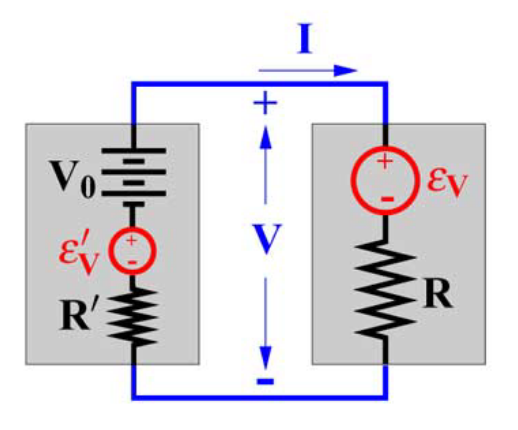

# GaussianRelations.jl

[](https://github.com/samuelsonric/GaussianRelations.jl/actions/workflows/tests.yml?query=workflow%3Atests)
[](https://codecov.io/gh/samuelsonric/GaussianRelations.jl)

GaussianRelations.jl is a Julia library that provides tools for working with Gaussian linear systems. It accompanies the paper [A Categorical Treatment of Open Linear Systems](https://arxiv.org/abs/2403.03934).

## Example: A Noisy Resistor

In the paper [Open Stochastic Systems](https://ieeexplore.ieee.org/abstract/document/6255764), Jan Willems defines a Gaussian linear system that he calls the "noisy resistor."

<p align="center">
    
</p>

Using our library, the noisy resistor can be implemented as follows.

```julia
using Catlab
using GaussianRelations

###############################
# Example 1: A Noisy Resistor #
###############################

σ₁ = 1/2
R₁ = 2

# ϵ₁ ~ N(0, σ₁²)
ϵ₁ = CovarianceForm(0, σ₁^2)

# Define the noisy resistor using a kernel representation.
#         [ I₁ ]
# [-R₁ 1] [ V₁ ] = ϵ₁
IV₁ = [-R₁ 1] \ ϵ₁

#################################################
# Example 3: The Noisy Resistor, Interconnected #
#################################################

σ₂ = 2/3
R₂ = 4
V₀ = 5

# ϵ₂ ~ N(0, σ₂²)
ϵ₂ = CovarianceForm(0, σ₂^2)

# Construct the second resistor.
#        [ I₁ ]
# [R₂ 1] [ V₂ ] = ϵ₂ + V₀
IV₂ = [R₂ 1] \ (ϵ₂ + V₀)

# The interconnected system solves the following equation:
# [ 1 0 ]         [ I₁ ]
# [ 0 1 ]         [ V₁ ]
# [ 1 0 ] [ I ]   [ I₂ ]
# [ 0 1 ] [ V ] = [ V₂ ]
IV = [1 0; 0 1; 1 0; 0 1] \ otimes(IV₁, IV₂)

# The interconnected system corresponds to the following undirected wiring diagram.
#       IV₁
#      /   \
# --- I     V ---
#      \   /
#       IV₂
diagram = @relation (I, V) begin
    IV₁(I, V)
    IV₂(I, V)
end

# We can also interconnect the systems by applying an operad algebra to the preceding
# diagram.
IV = oapply(diagram, Dict(:IV₁ => IV₁, :IV₂ => IV₂), Dict(:I => 1, :V => 1))

# If a system is classical, access its parameters by calling the functions mean and cov.
mean(IV)
cov(IV)

##################################################
# Example 5: The Noisy Resistor With Constraints #
##################################################

# I₂ = 1 amp.
I₂ = CovarianceForm(1, 0)

# The constrained system solves the following equation:
# [ 1 0 ]         [ I₁ ]
# [ 0 1 ] [ I ]   [ V₁ ]
# [ 1 0 ] [ V ] = [ I₂ ]
IV = [1 0; 0 1; 1 0] \ otimes(IV₁, I₂)

# Marginalize over I by computing
#           [ I ]
# V = [0 1] [ V ]
V = [0 1] * IV

# The constrained system corresponds to the following undirected wiring diagram.
#    IV₁
#   /   \
#  I     V ---
#   \
#    I₂
diagram = @relation (V,) begin
    IV₁(I, V)
    I₂(I)
end

# We can also constrain the system by applying an operad algebra to the preceding
# diagram.
V = oapply(diagram, Dict(:IV₁ => IV₁, :I₂ => I₂), Dict(:I => 1, :V => 1))
```
